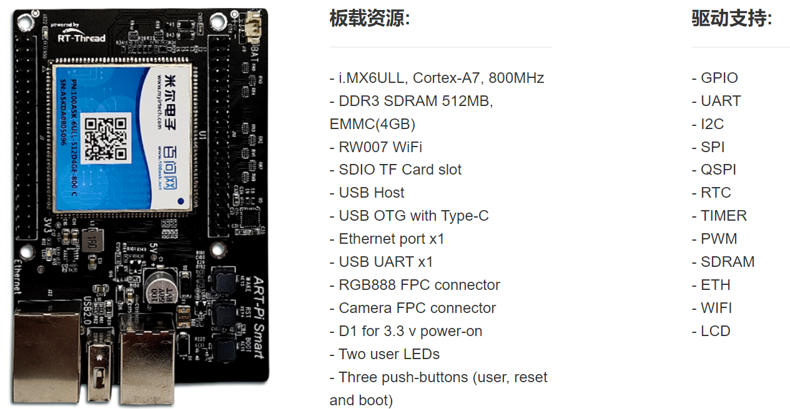
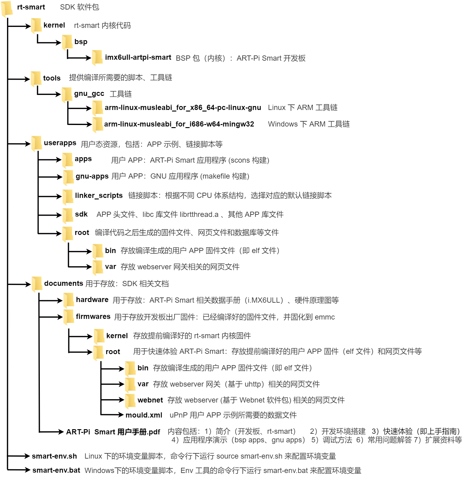
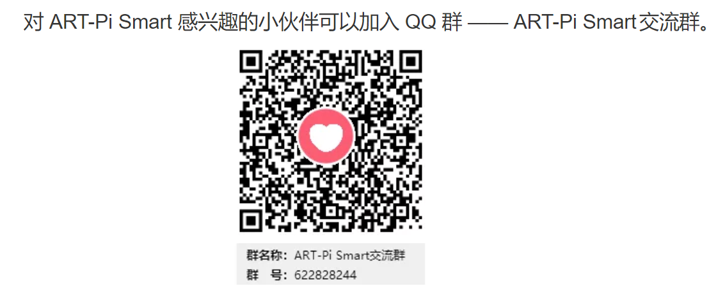

# ART-Pi Smart 开发板 SDK 仓库

## 简介

 [ART-Pi-Smart SDK 仓库](https://gitee.com/rtthread/ART-Pi-smart) 是 RT-Thread 团队对 ART-Pi Smart 开发板所作的支持包，用于学习和评估 RT-Thread Smart 微内核操作系统，让用户可以更简单方便地开发自己的应用程序。

ART-Pi smart 开发板的 SDK 仓库，主要包括 RT-Thread Smart 的源码，BSP 驱动，应用程序 demo 等。

如果您想了解更多关于 **ART-Pi Smart** 最新的开源扩展硬件及技术分享文章，请访问 ART-Pi Smart [主页](https://art-pi.gitee.io/smart-website/)。

## 目录结构

如下图所示为 ART-Pi Smart SDK 软件包结构框图。其中，rt-smart kernel 为 imx6ull-artpi-smart。

**工具链的下载和安装**：

- rt-smart 采用的工具链为：arm-linux-musleabi 工具链
- 需要用户自行通过下面网址下载 Linux版本或 Windows 版本的工具链
- 链接: https://pan.baidu.com/s/1p7PRhV3dTGIb7hxv34YWYw 提取码: ndxq 
- 将下载下来的工具链，解压到指定的路径 `tools/gnu_gcc` 下面

## 如何使用 SDK

ART-Pi smart  支持 Windows 和 Linux 开发环境，及配套的 VSCode 开发环境。并且支持多种编译方式，例如 scons、make、cmake等。

- VSCode 上开发 rt-smart，包括安装  rt-thread-smart VSCode 插件、新建工程、编译代码等，具体请查阅文档：[RT-Thread Smart for Vscode 快速上手](documents/rt_smart_for_vscode_quick_start/README.md) 。
- ART-Pi Smart 开发板软硬件资料，以及开发环境（Linux 和 Windows版本）、BSP Demo等，具体请查阅文档：[ART-Pi Smart 用户手册](documents/art_pi_smart_user_manual/README.md) 。

## ART-Pi Smart 交流平台

ART-Pi  Smart 是一个开源创意硬件平台，期待有更多的小伙伴能一起发现更多的乐趣，在使用过程中若您有任何的想法和建议，建议您通过以下方式来联系到我们。

- ART-Pi Smart [主页](https://art-pi.gitee.io/smart-website/)

- ART-Pi Smart SDK [Gitee 仓库 ](https://gitee.com/rtthread/ART-Pi-smart)

- RT-Thread [社区论坛](https://club.rt-thread.org)
- rt-smart [论坛板块](https://club.rt-thread.org/ask/tag/1339.html )（可以发帖反馈，技术支持） 
- ART-Pi Smart 官方交流 QQ 群(622828244)

## 贡献代码

如果您对 ART-Pi Smart 感兴趣，并有一些好玩的项目愿意与大家分享，欢迎给我们贡献代码 。

可以参与哪些项目：

- 维护现有 SDK 仓库代码
- 提交工程代码可以合并到 SDK 仓库
- 提交展示工程，代码无法合并到 SDK 仓库，但是代码开源在其他地方
- 撰写专栏文章
