**变更历史**

| 版本 | 内容描述                                           | 编制/日期             |
| :--- | -------------------------------------------------- | :-------------------- |
| V1.0 | 正式发布。                                         | Blues Lin  2021-11-01 |
| V2.0 | 增加章节：webserver 网关开发环境搭建、常见问题解答 | Blues Lin  2021-11-11 |


# 概述

## rt-smart 实时操作系统简介

RT-Thread Smart（简称 rt-smart）嵌入式实时操作系统是基于 RT-Thread 操作系统衍生的新分支，面向带 MMU，中高端应用的芯片，例如 ARM Cortex-A 系列芯片，MIPS 芯片，带 MMU 的 RISC-V 芯片等。rt-smart 在 RT-Thread 操作系统的基础上启用独立、完整的进程方式，同时以混合微内核模式执行。

rt-smart 是一款高性能混合微内核操作系统，在传统嵌入式操作系统划分中，rt-smart 能够填补传统 RTOS 和大型操作系统 Linux 之间的空白，在实时性、成本、安全性、启动速度等方面可以取得最佳的平衡。

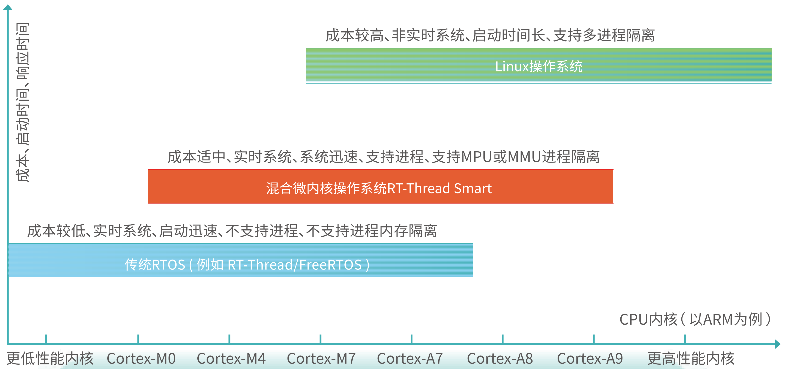


rt-smart 操作系统架构框图，如下图所示。rt-smart 操作系统主要包含内核模块和用户态运行时环境。内核模块包括虚拟地址空间管理、进程管理、线程管理、进程间通信、虚拟文件系统框架、网络接口层框架、设备驱动框架、msh 控制台、日志系统、异常中断管理和系统调用接口，设备驱动框架包含串口驱动框架和看门狗驱动框架。用户态运行时环境包括用户态 C 库。


**rt-smart 功能特点** 

- 快速启动
  - 相比 Linux 十几秒以上的启动时间，rt-smart 启动速度最快可达 300ms 以内，特别适合安防、汽车仪表盘、工业控制、AIOT 等领域
- 高实时性
  - 抢占式调试内核，任务响应性能与 Linux 相比更加优秀
  - 微秒级中断响应能力，能够第一时间对事件作出处理
- 高安全性
  - 通过简单有效的系统设计与实现，为构建高可信环境提供坚实基础。
- 无缝对接 Linux 开发生态
  - 全面兼容支持 POSIX API 规范，极大程度降低 Linux 应用的移植成本，能更快速获得全球开源社区资源
- 丰富的组件
  - 继承 RT-Thread 十几年的软件生态积累，更易获得丰富的 RT-Thread 软件包支持
  - 提供专业的人机交互图形组件 Persimmon UI，支持 JavaScript 等高级语言开发
- 极低的资源占用
  - OS 占用极少的内存空间和 Flash 空间，可最大化降低物料成本
- 开发调试便利
  - 应用与内核分离，使用 VScode、RT-Thread Studio 开发调试应用，大幅度降低应用开发门槛

## ART-Pi Smart 开发板简介

ART-Pi Smart 核心板使用的是 NXP 公司的 i.MX6ULL 处理器，具备单核 ARM Cortex-A7，最高运行频率可以达到 800MHz。拥有 1 路 LCD 显示、1 路数字摄像头、8 路 UART、2 路 USB OTG、2 路 CAN、2 路以太网等资源，便于客户灵活定制。  

i.MX6ULL 核心板资源情况，如下所示：

| 名称         | 描述              |
| ------------ | ----------------- |
| 主控芯片系列 | i.MX6ULL 系列     |
| 主控芯片型号 | MCIMX6Y2CVM05AB   |
| 内存         | DDR3 SDRAM  512MB |
| 存储器       | EMMC（4GB）       |

ART-Pi Smart 硬件接口图和 i.MX6ULL 核心板系统框图，如下所示：

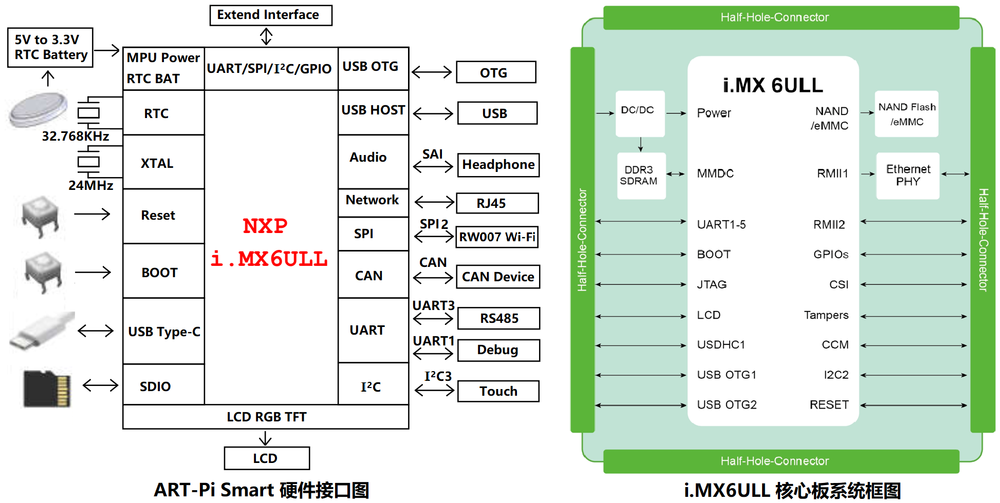

## i.MX6ULL 系列处理器简介

i.MX 6ULL 是一个高功效、高性价比应用处的理器系列，采用单个 Arm Cortex-A7 内核，运行速度高达 800MHz。i.MX 6ULL 应用处理器包括了一个集成的电源管理模块，降低了外接电源的复杂性，并简化了上电时序。这个系列的每个处理器提供多种存储器接口，其中包括 16 位 LPDDR2、DDR3、DDR3L、原始和管理的 NAND 闪存、NOR 闪存、eMMC、Quad SPI 和各种其他接口，用于连接外围设备，如 WLAN、Bluetooth、GPS、显示器和摄像头传感器。

相比于 i.MX6UL 系列处理器，i.MX6ULL 精简了部分加密功能，同时保持了原有的高性价比、超低功率等特点，可以将其看作 i.MX6UL 系列的成本优化版本。  

i.MX6ULL 功能结构图，如下所示：

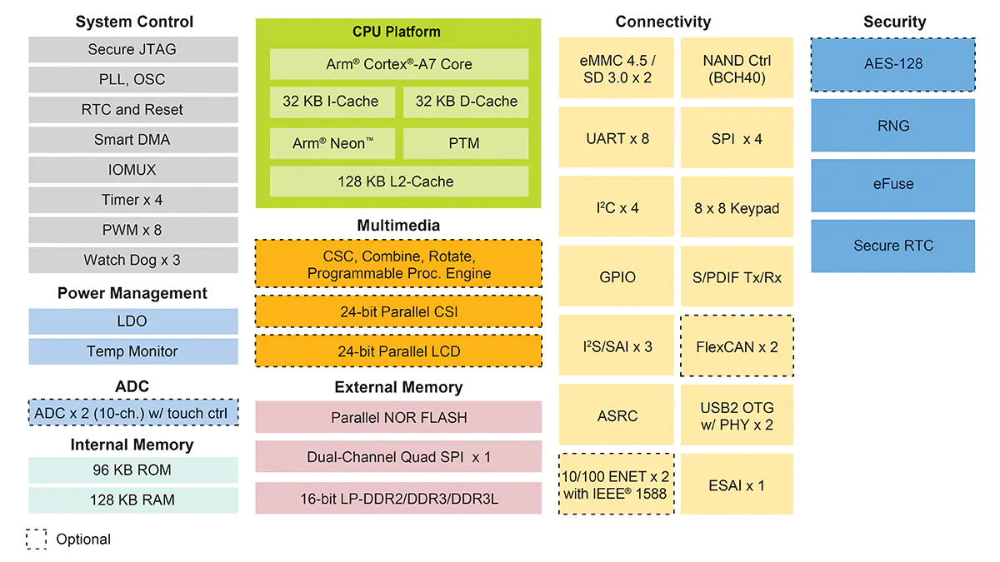

- i.MX6ULL 处理器主要特性：  
  - ARM® Cortex®-A7 内核，运行频率 528MHz/ 800MHz
  - 并行 LCD 显示，分辨率高达 WXGA（1366x768）
  - 8/10/16/24 位并行摄像头传感器接口
  - 16 位 LP-DDR2, DDR3/DDR3L
  - 8/16 位并行 NOR FLASH / PSRAM
  - 双通道 Quad-SPI NOR FLASH
  - 两个 USB 2.0 OTG，HS/FS，器件或主机
  - 两个 10/100 以太网，支持 IEEE 1588 协议
  - 两个 MMC 4.5/SD 3.0/SDIO 端口
  - 音频接口包括 3 个 I2S/SAI, S/PDIF Tx/Rx
  - 两个 ADC 模块，支持最多 10 个输入通道，以及电阻式触摸控制器（4 线/5 线)
  - 部分 PMU 集成
  - 安全模块：TRNG，加密引擎（带 DPA 的 AES，TDES/SHA/RSA），安全启动

# 开发环境搭建

## 硬件环境搭建

- 电源输入：5V，500 mA，通过开发板 USB-TypeC（下面）供电。如下图所示，通过测试电脑的 USB 直接对开发板供电
- 串口连接：下方的 USB-TypeC 接口，既是用作电源供电，同时也是 USB 转 UART 接口，主要用于打印系统的控制台输入和输出

| 波特率 | 数据位 | 停止位 | 校验位 | 流控 |
| :----- | ------ | ------ | ------ | ---- |
| 115200 | 8      | 1      | 无     | 无   |

- 网络接口：通过路由器和网线，将开发板和测试电脑连接在同一个局域网内

- Micro SD卡：32GB 或 32GB 以下。可使用读卡器将编译生成的用户 APP 固件文件（.elf）复制到 SD 卡

  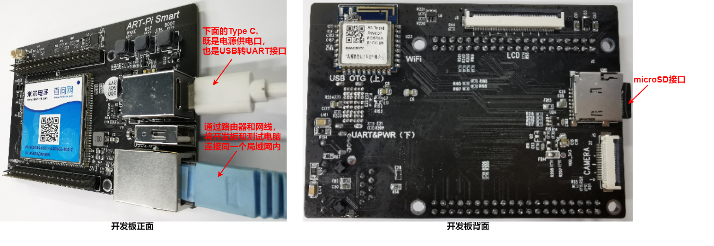

- ART-Pi Smart 扩展 IO 分布图 （双排针）

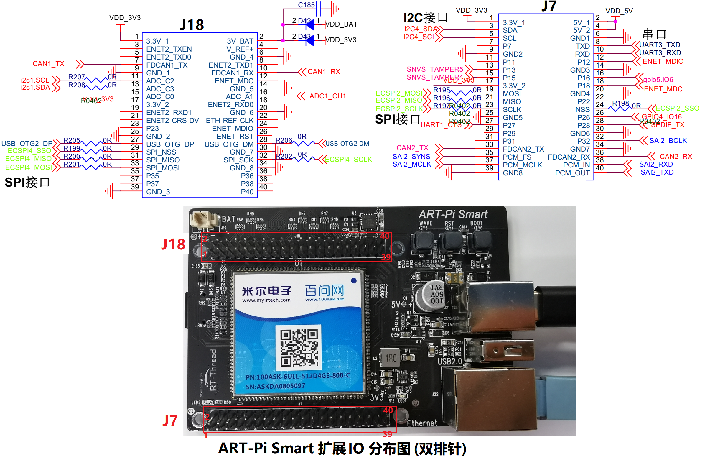


## ART-Pi Smart SDK 软件包资源

- 通过 [ART-Pi-Smart SDK 仓库](https://gitee.com/rtthread/ART-Pi-smart) （Gitee）下载最新的 ART-Pi Smart SDK 软件包
- ART-Pi Smart SDK 软件包结构框图，如下所示。其中，Kernel 部份仅包含一个 BSP：imx6ull-artpi-smart
- 工具链的下载和安装
  - rt-smart 采用的工具链为：arm-linux-musleabi 工具链
  - 需要用户自行通过下面网址下载 Linux版本或 Windows 版本的工具链
  - 链接: https://pan.baidu.com/s/1p7PRhV3dTGIb7hxv34YWYw 提取码: ndxq 
  - 将下载下来的工具链，解压到指定的路径 /rt-smart/tools/gnu_gcc/ 下面

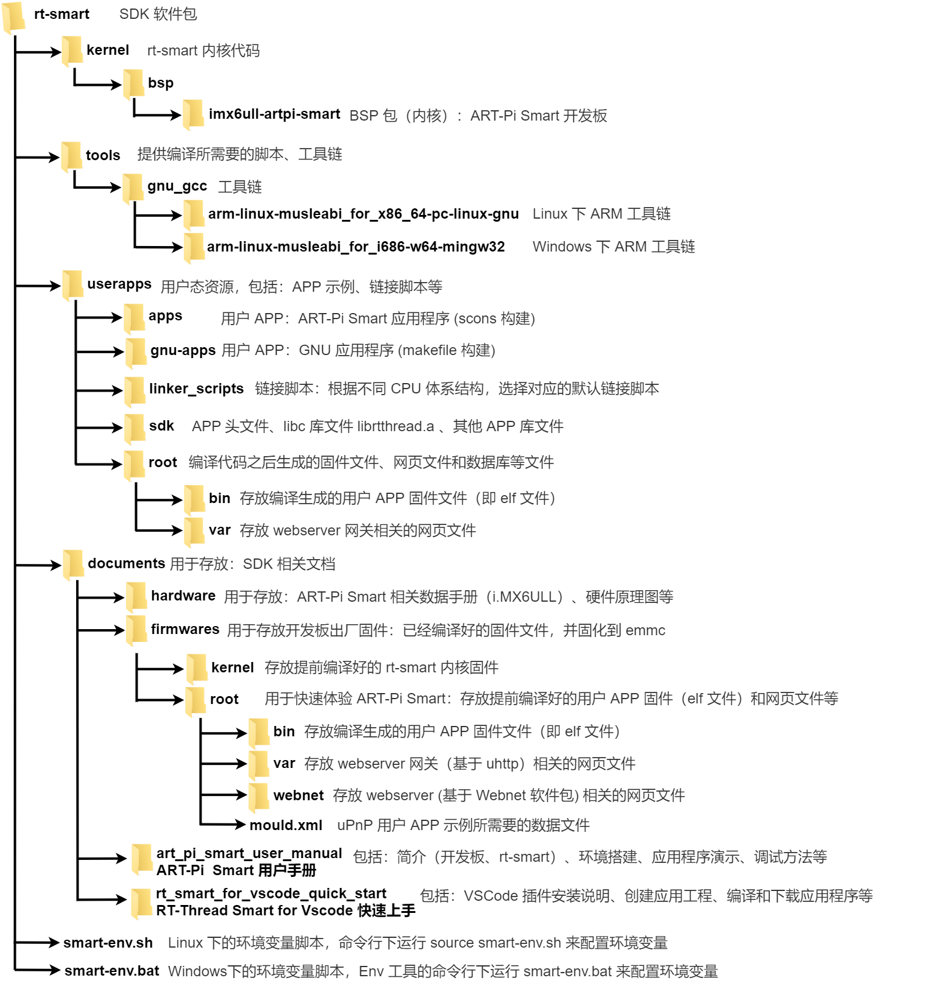

## rt-smart 文件系统框架简介

为了方便用户开箱快速体验 rt-smart，ART-Pi Smart 开发板在出厂前，已经提前将 rt-smart 内核固件文件（/kernel/rtthread.bin）、webserver 用户 APP 固件（/root/bin/uhttpd.elf ）、webserver 网页文件（ /root/var/ ）存到 rt-smart 所使用的 emmc 第四分区（即 mmc 1:4），如下图所示：

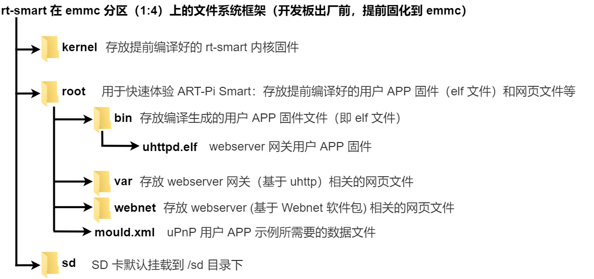

- 为了方便开发人员能够快速体验 rt-smart。SDK 里面分别指供了 Windows 版本（ Env 工具）和 Linux 版本开发环境
- 因为 Linux 环境更便于移植 Linux 的应用，不需要专门去编写新的构建脚本，而直接使用原有的脚本。故我们**建议使用 Linux 作为主要开发环境**


# 开机体验 rt-smart：webserver 网关

## webserver 网关简介

在 ART-Pi Smart SDK 里面提供了一个 gnu-app 示例：webserver 网关，并作为 ART-Pi Smart 的出厂 Demo。

即移植 GNU 软件代码交叉编译成目标系统平台可以运行的库或二进制文件，作为 rt-smart 的一个用户 APP，并在 ART-Pi Smart 开发板上运行。

用户也可以根据 文档下面的章节 “用户 APP（gnu-apps）： webserver 网关开发环境搭建” 自行尝试编译此 gnu-app 示例中所有的固件。


## webserver 网关功能主要模块简介

- 首页展示：
  - CPU、内存、空间的使用情况，默认 5s 刷新一次，可以设置
  - 表格形式展示系统版本、编译日期、gcc 编译器版本以及网络信息等
  - 支持系统时间显示，每隔一定时间与系统同步一次，间隔可设置
  - 支持网络状态监测，与 CPU、内存等的刷新频率一致

- 用户管理：
  - 表格形式展示系统所有用户
  - 支持修改密码
  - 支持删除用户
  - 支持增加用户

- LED控制：
  - 支持对 LED 进行开关操作
  - 支持对 LED 状态实时显示，刷新频率可设置

- 系统日志：
  - 表格形式展示日志内容，用户的所有行为都会记录到日志中
  - 支持删除日志

- 系统设置：
  - 设置首页的系统信息刷新频率
  - 设置 LED 状态刷新频率
  - 设置时间同步间隔频率


## 快速体验 webserver 网关

1. 通过将 USB-TypeC 连接到电脑 USB 给开发板供电，ART-Pi Smart 开发板会通过 u-boot 自动加载 emmc 中的 rt-smart 内核固件文件（/kernel/rtthread.bin）到内存去运行。同时也会自动运行 webserver 用户 APP。

2. rt-smart 内核跑起来后，打开串口调试助手，通过下面命令先查看一下开发板的 IP 地址

   ```bash
   # 获取开发板 IP 地址
   msh />ifconfig
   
   network interface device: e1 (Default)
   MTU: 1500
   MAC: a8 5e 45 91 92 93 
   FLAGS: UP LINK_UP INTERNET_UP DHCP_ENABLE ETHARP BROADCAST IGMP
   ip address: 192.168.10.168
   gw address: 192.168.10.1
   net mask  : 255.255.255.0
   ipv6 link-local: FE80::AA5E:45FF:FE91:9293 VALID
   ipv6[1] address: 0.0.0.0 INVALID
   ipv6[2] address: 0.0.0.0 INVALID
   dns server #0: 192.168.10.1
   dns server #1: 0.0.0.0
   ```

3. 打开浏览器，输入开发板的 IP 地址，显示 webserver 登录界面

   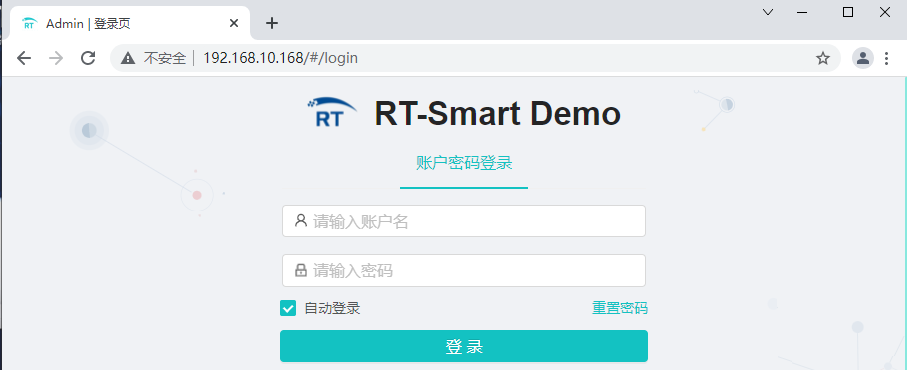

4. 在浏览器上，输入默认的帐号：admin 和密码：admin 即可登录到 Webserver 网关主页面

   ⚠️如果输入帐号和密码之后，无法登录到 Webserver 网关主页面，请尝试刷新一下浏览器网页，然后重新输入默认的帐号和密码重新登录。

   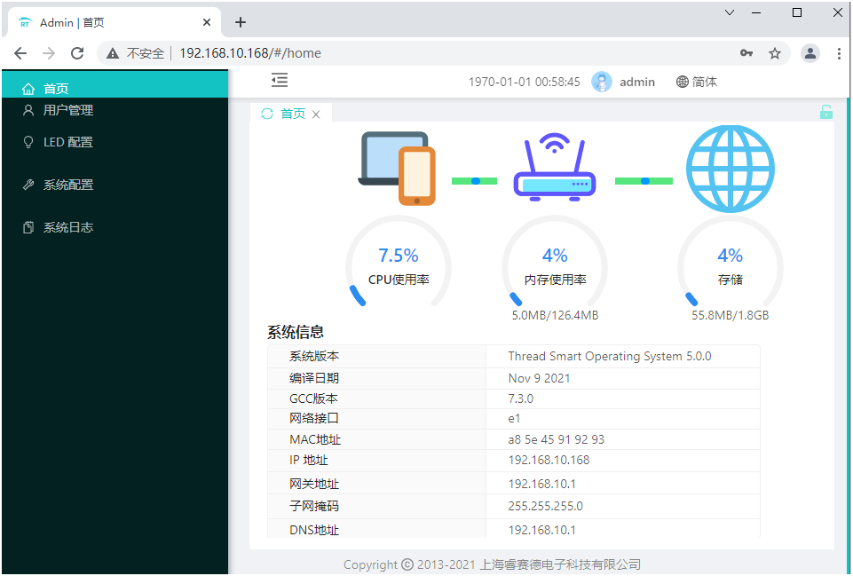

5. 点击网页右边的菜单，分别可以进行不同的操作：用户管理、LED 配置、系统配置、系统日志等

   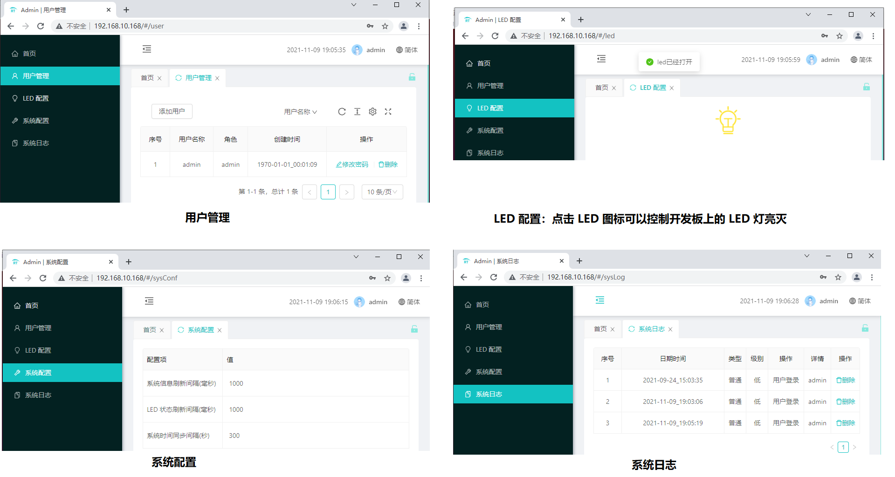


# Windows 下，快速体验 rt-smart

## 环境准备（基于 Windows 环境）

### 安装 Env 环境

- Windows 下，从 RT-Thread 官网下载 Env 工具：https://www.rt-thread.org/page/download.html
- Env 用户手册（准备工具、使用方法）： https://www.rt-thread.org/document/site/#/development-tools/env/env
- Env 工具集成了编译构建环境（scons）、图形化系统配置（menuconfig）及软件包管理功能等工具
- 通过 [ART-Pi-Smart SDK 仓库](https://gitee.com/rtthread/ART-Pi-smart) （Gitee）下载最新的 ART-Pi Smart SDK 软件包

## 代码编译

### 设置环境变量（基于 Windows）

打开 Env 控制台终端窗口，然后切换到这个代码包根目录，**运行 smart-env.bat**  进行环境变量的设置，然后整体的 rt-smart 开发环境就可以使用了，具体操作如下所示：

```bash
# 进入到 rt-smart 目录
> cd rt-smart

# 设置对应的环境变量（rt-smart 工具链、编译器等）。和原 RT-Thread 相比，多了 RTT_CC_PREFIX 环境变量
> smart-env.bat

# 查看环境变量是否生效，输入下面命令，即可查看 musl 工具链、RTT_CC_PREFIX 环境变量
> set RTT

RTT_CC=gcc
RTT_CC_PREFIX=arm-linux-musleabi-
RTT_EXEC_PATH=E:\test\rt-smart\tools\gnu_gcc\arm-linux-musleabi_for_i686-w64-mingw32\bin

# [可选操作]确定工具链是否可以使用，输入下面命令，即可查看工具链相关版本信息
> arm-linux-musleabi-gcc -v

Using built-in specs.
COLLECT_GCC=arm-linux-musleabi-gcc
COLLECT_LTO_WRAPPER=e:/test/rt-smart/tools/gnu_gcc/arm-linux-musleabi_for_i686-w64-mingw32/bin/../libexec/gcc/arm-linux-musleabi/7.3.0/lto-wrapper.exe
Target: arm-linux-musleabi
Configured with: ../src_gcc/configure --disable-werror --prefix= --target=arm-linux-musleabi --with-sysroot=/arm-linux-musleabi --with-build-sysroot=/builds/research/musl-toolchain/build/arm-linux-musleabi_for_i686-w64-mingw32/sysroot/ --enable-languages=c,c++ --disable-multilib --enable-tls --disable-libmudflap --disable-libsanitizer --disable-gnu-indirect-function --disable-libmpx --enable-libstdcxx-time --host=i686-w64-mingw32 --disable-bootstrap AR_FOR_TARGET=arm-linux-musleabi-ar AS_FOR_TARGET=arm-linux-musleabi-as LD_FOR_TARGET=arm-linux-musleabi-ld NM_FOR_TARGET=arm-linux-musleabi-nm OBJCOPY_FOR_TARGET=arm-linux-musleabi-objcopy OBJDUMP_FOR_TARGET=arm-linux-musleabi-objdump RANLIB_FOR_TARGET=arm-linux-musleabi-ranlib READELF_FOR_TARGET=arm-linux-musleabi-readelf STRIP_FOR_TARGET=arm-linux-musleabi-strip
Thread model: posix
gcc version 7.3.0 (GCC)
build date: Sep 30 2021 13:47:19
build sha: b998444eb32a74bdeb55fd70963187255ae6efe0
build job: 173019
```

### 编译 rt-smart 内核代码（基于 imx6ull-artpi-smart BSP）

```bash
# 进入到 rt-smart 的 imx6ull-artpi-smart BSP 内核目录
> cd rt-smart\kernel\bsp\imx6ull-artpi-smart\

# 清除编译生成的临时文件和目标文件
> scons -c

# 编译 rt-smart 内核
> scons 
```

- 如果编译无误，会生成 rtthread.elf、rtthread.bin、rtthread.imx 内核的固件文件
  - 生成的 rtthread.imx 内核固件文件，用于 USB 方式加载内核固件至开发板运行
  - 生成的 rtthread.bin 内核固件文件，用于 Uboot + TFTP 方式加载内核固件至开发板运行

- 如果编译代码时，想同时查看详细的编译 log，可以使用`scons --verbose`命令来编译构建

### 编译用户应用代码

```bash
# 进入到 rt-smart/userapp 用户代码目录
> cd rt-smart/userapps

# 清除编译生成的临时文件和目标文件
> scons -c

# 只编译 rt-smart/userapp/apps 目录下的用户 APP 代码：hello。编译成功后，在 userapps/root/bin 目录下会生成 hello.elf 固件文件
> scons --app=hello

# 编译 rt-smart/userapp/apps 目录下的所有用户 APP。编译成功后，在 userapps/root/bin 目录下会生成所有用户APP相对应的 *.elf 固件文件
> scons 

# [可选操作]如果要缩小可执行程序的体积(删除固件中调试信息)，例如，缩小 hello.elf 固件体积。⚠️如果需要 gdb 调试用户 APP 时，则不能进行此操作
> arm-linux-musleabi-strip root/bin/hello.elf
```

- 如果编译无误，“userapps” 目录下的用户应用程序，将编译成一个个“.elf” 可执行文件，存放于 userapps/root/bin 目录
- 将 root 整个文件夹（包含了用户 APP 的 elf 固件文件）通过 USB 读卡器直接复制到 SD 卡，并将 SD 卡插到 ART-Pi Smart 开发板背面的 Micro SD 卡槽

## 内核固件下载和启动

i.MX6ULL 系列处理器启动方式多样，启动时会首先执行芯片内部 Boot ROM 中的程序。Boot ROM 会根据 BOOT_MODE 寄存器、eFUSEs、配置管脚等状态来决定启动模式以及启动设备。故在启动前，用户可根据自己需要配置 ART-Pi Smart 开发板的启动方式。

目前，ART-Pi Smart 开发板有以下两种启动方式：

- eMMC 模式（默认启动模式）：ART-Pi Smart 上电时，默认从 eMMC 启动，自动运行 U-Boot

- USB 模式：选择从 USB  启动，通过 USB 接口（上方的 USB-TypeC OTG 接口），串行下载固件

  操作方法：开发板上电之后，先按下 "BOOT 启动按键" 不松开，然后，再按下 “RST 复位键”，即可切换到 USB 固件下载模式。

### 方法一：通过 Uboot + TFTP 方式启动 rt-smart 内核

1. 首先准备一台 Windows 测试电脑，下载并安装 Tftpd64 工具（[Tftpd64-4.64-setup.exe](https://bitbucket.org/phjounin/tftpd64/downloads/Tftpd64-4.64-setup.exe)）：https://bitbucket.org/phjounin/tftpd64/downloads/

   ⚠️ Tftpd64 工具需要到外网去下载，网络不稳定。如果出现无法访问或无法下载，请多刷新网页多尝试几次。

2. 在测试电脑上，提前设置好 TFTP 服务器，并配置目录定位到 rtthread.bin 文件所在的目录

   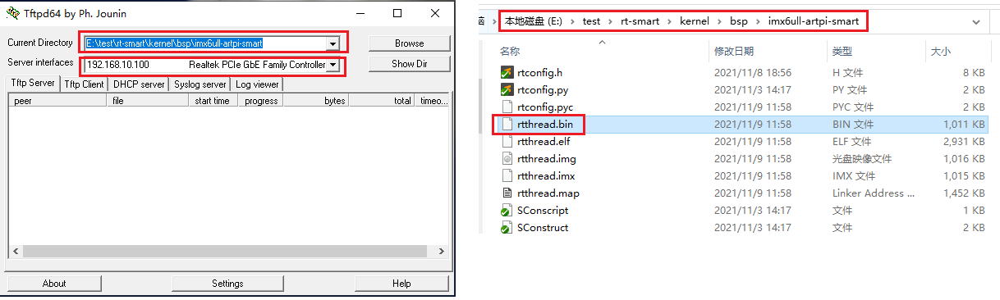

3. 将 ART-Pi Smart 开发板通过有线网口和测试电脑处于同一个局域网（例，将开发板和测试电脑通过网线连接到同一台路由器或交换机）

   ⚠️将网线插到 ART-Pi Smart 开发板的网口，请检查网口上两个 LED 灯（绿色和黄色）是否亮起。

4. 将 USB-TypeC（下面的）连接到电脑给开发板上电，上电时将默认从 eMMC 启动，自动运行 U-Boot

5. 在测试电脑上，打开串口调试终端：115200 波特率、8 位数据位、1 位停止位、无奇偶校验、无流控

6. 按下 ART-Pi Smart 开发板上的 “ RST 复位键” ，让开发板复位并进入到 “uboot 启动” 倒计时

7. 在进入 “uboot 启动” 倒计时结束之前，按下键盘任意键，进入到手动模式

   ⚠️如果没有进入到手动模式，则开发板会自动进入到 i.MX6ULL 核心板自带的嵌入式 Linux 系统。

   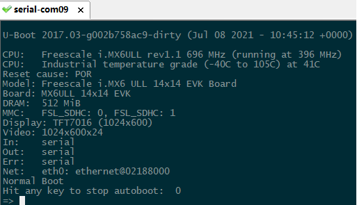

8. 输入命令，将 rt-smart 内核固件文件 rtthread.bin，通过网络加载至内存中运行

9. 命令格式：dhcp  TFTP 服务器 IP（即，测试电脑 IP 地址）:固件文件（xx.bin文件）;dcache flush;go 固件入口地址

   ```bash
   dhcp 0x80001000 192.168.10.100:rtthread.bin;dcache flush;go 0x80001000
   ```

10. 如果都正常的话，在串口调试终端，就可以看到 rt-smart 内核系统的启动信息

    ```bash
     \ | /
    - RT -     Thread Smart Operating System
     / | \     5.0.0 build Nov  9 2021
     2006 - 2020 Copyright by rt-thread team
    lwIP-2.1.2 initialized!
    [15] E/drv.enet: emac device init success
    
    [20] I/I2C: I2C bus [i2c3] registered
    [76] I/SDIO: SD card capacity 3813376 KB.
    found part[0], begin: 8192, size: 3.651GB
    [90] E/drv.enet: 
    PHY Link down, please check the cable connection and link partner setting.
    
    [140] I/SDIO: emmc card capacity 3817472 KB.
    found part[0], begin: 2098176, size: 1000.0MB
    found part[1], begin: 1050674176, size: 1.476GB
    found part[2], begin: -1671429120, size: [159] I/touch: rt_touch init success
    [163] I/gt911: touch device gt911 init success
    [169] I/sal.skt: Socket Abstraction Layer initialize success.
    500.0MB
    file system initialization done!
    hello rt-smart
    msh />[5033] D/drv.enet: enet1 link up
    ```

    

### 方法二：通过 USB 方式启动 rt-smart 内核（基于 Windows 环境）

1. 首先准备一台 Windows 测试电脑，下载 100ask_imx6ull 烧写工具（由百问网提供）

   - 工具下载地址：https://github.com/100askTeam/gui_for_nxp_uuu/tree/master/100ask_imx6ull%E7%83%A7%E5%86%99%E5%B7%A5%E5%85%B7

   - ⚠️100ask_imx6ull 烧写工具需要到 GitHub 外网去下载，网络不稳定。如果出现无法访问或无法下载，请多刷新网页多尝试几次

2. 将用于烧录的那根 USB-TypeC（上方） 先连接到 Windows 测试电脑

3. 将另外一根 USB-TypeC（下方）也连接上 Windows 测试电脑，给开发板供电

4. 在测试电脑上，打开串口调试终端：115200 波特率、8位数据位、1位停止位、无奇偶校验、无流控

5. 先拔掉 ART-Pi Smart 开发板上的 SD 卡（⚠️必须先拔掉 SD 卡）

   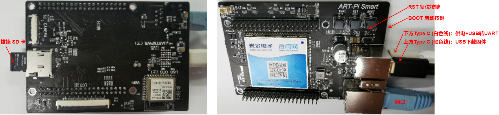

6. 配置 ART-Pi Smart 开发板进入到 USB 固件下载模式

   操作方法：开发板上电之后，先按下 "BOOT 启动按键" 不松开，然后，再按下 “RST 复位键”，即可切换到 USB 固件下载模式。

7. Windows 测试电脑上，打开烧录工具 100ask_imx6ull_flashing_tool.exe，查看烧录工具是否与ART-Pi Smart USB 连接成功

   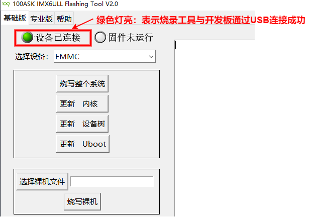

8. USB 连接成功后，再把 SD 卡插回 ART-Pi Smart 开发板背面的 Micro SD 卡槽。

   ⚠️记得，提前先把后面要运行的用户APP的 *.elf 固件文件（即 root 文件夹）提前复制到 SD 卡。

9. 通过 100ask_imx6ull_flashing_tool 烧录工具将 rt-smart 内核固件文件 rtthread.imx，通过 USB 加载至内存中运行

   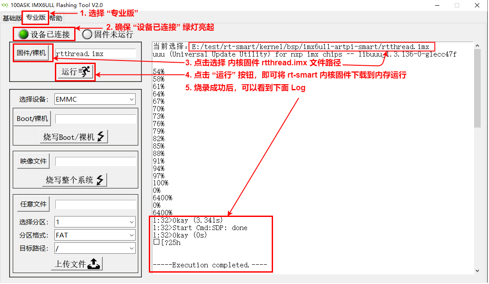

10. 如果都正常的话，在串口调试终端，就可以看到 rt-smart 内核系统的启动信息

    ```bash
     \ | /
    - RT -     Thread Smart Operating System
     / | \     5.0.0 build Sep 28 2021
     2006 - 2020 Copyright by rt-thread team
    lwIP-2.1.2 initialized!
    [15] E/drv.enet: emac device init success
    ```

11. rt-smart 内核跑起来之后，可以输入下面命令获取开板一些基本信息，操作方式与其 rt-thread RTOS 一样

    ```bash
    # 获取开发板 IP 地址
    msh />ifconfig
    
    network interface device: e1 (Default)
    MTU: 1500
    MAC: a8 5e 45 91 92 93 
    FLAGS: UP LINK_UP INTERNET_UP DHCP_ENABLE ETHARP BROADCAST IGMP
    ip address: 192.168.10.168
    gw address: 192.168.10.1
    net mask  : 255.255.255.0
    ipv6 link-local: FE80::AA5E:45FF:FE91:9293 VALID
    ipv6[1] address: 0.0.0.0 INVALID
    ipv6[2] address: 0.0.0.0 INVALID
    dns server #0: 192.168.10.1
    dns server #1: 0.0.0.0
    
    # 查看 SD 卡是否正常挂载，用户APP的 elf 固件是否已经提前存放到 SD 卡。执行 ls 命令，可以看到 SD 卡根目录下，会有一个 root 目录
    msh />ls
    Directory /:
    System Volume Information<DIR>                    
    root                <DIR>      
    
    # 进入到目录 root/bin,查看 SD 卡里面的用户 APP 固件
    msh />cd root/bin
    msh /root/bin>ls
    Directory /root/bin:
    hello.elf           202308                
    gpio.elf            203448                                    
    ping.elf            203572                   
    pong.elf            203004 
    ```

    

## 用户 APP 示例演示：hello

```bash
# 进入到用户 APP 应用程序目录：root/bin/
msh />cd root/bin

# 显示 bin 目录下的用户 APP 是否已存在 hello.elf 用户 APP 固件文件
msh /root/bin>ls

Directory /bin:               
hello.elf           202308                   
gpio.elf            203448   

# 运行用户 APP: hello.elf 
msh /root/bin>hello.elf

# 运行了一次编译的应用程序 root/bin/hello.elf，可以看到应用程序输出 hello world! 打印信息后自动退出
msh /root/bin>hello world!
```

# Linux 下，快速体验 rt-smart

## 环境准备（基于 Linux 环境）

### Ubuntu Linux 环境搭建

此文档是基于 Ubuntu 20.04.2 ，通过 VirtualBox 虚拟机搭建 Ubuntu 系统环境，其他 Linux 版本类似。

- Ubuntu 系统起来之后，打开一个终端（可使用快捷键：Ctrl+Alt+T 打开终端）

- 安装  Scons 编译构建工具，使用命令：

  ```bash
  $ sudo apt-get install scons
  ```

- Ubuntu 20.04.2 默认安装了 Python 3.8.10，由于 SDK 软件包用到一些 Python 脚本，故需要将 python 默认指向为 python3.8，使用命令：

  ```bash
  # 将 python 默认指向为 python3.8
  $ sudo ln -s /usr/bin/python3.8 /usr/bin/python
  
  # 查看 pytho 版本
  $ python --version
  
  Python 3.8.10
  ```

- 在 Linux 环境下，通过 [ART-Pi-Smart SDK 仓库](https://gitee.com/rtthread/ART-Pi-smart) （Gitee）下载最新的 ART-Pi Smart SDK 软件包

  ⚠️⚠️⚠️由于 Linux 环境和 Windows 环境的区别，请不要把 Windows 下使用过（解压过）的 SDK 软件包复制到 Linux 下去运行。请直接下载 SDK 压缩包到 Linux 下去解压并运行。

## 代码编译

### 设置环境变量（基于 Linux）

打开一个终端（可使用快捷键：Ctrl+Alt+T 打开终端），进行下面操作来设置环境变量。

```bash
# 进入到 rt-smart 目录
$ cd rt-smart

# 设置对应的环境变量（rt-smart 工具链、编译器等）。和原 RT-Thread 相比，多了 RTT_CC_PREFIX 环境变量
$ source smart-env.sh

Arch      => arm
CC        => gcc
PREFIX    => arm-linux-musleabi-
EXEC_PATH => /home/test/rt-smart/tools/gnu_gcc/arm-linux-musleabi_for_x86_64-pc-linux-gnu/bin

# [可选操作]确定工具链是否可以使用，输入下面命令，即可查看工具链相关版本信息
$ arm-linux-musleabi-gcc -v
```

### 编译 rt-smart 内核代码

```bash
# 进入到 rt-smart 的 BSP 内核目录
$ cd rt-smart/kernel/bsp/imx6ull-artpi-smart/

# 清除编译生成的临时文件和目标文件
$ scons -c

# 编译 rt-smart 内核
$ scons 
```

- 如果编译无误，会生成 rtthread.elf、rtthread.bin、rtthread.imx 内核的固件文件
  - 生成的 rtthread.imx 内核固件文件，用于 USB 方式加载内核固件至开发板运行
  - 生成的 rtthread.bin 内核固件文件，用于 Uboot + TFTP 方式加载内核固件至开发板运行

- 如果编译代码时，想同时查看详细的编译 log，可以使用`scons --verbose`命令来编译构建

### 编译用户应用代码

```bash
# 进入到 rt-smart/userapp 用户代码目录
$ cd rt-smart/userapps

# 清除编译生成的临时文件和目标文件
$ scons -c

# 编译用户 APP 代码
$ scons 

# 只编译 rt-smart/userapp/apps 目录下的用户 APP 代码：hello。编译成功后，在 userapps/root/bin 目录下会生成 hello.elf 固件文件
> scons --app=hello

# 编译 rt-smart/userapp/apps 目录下的所有用户 APP。编译成功后，在 userapps/root/bin 目录下会生成所有用户APP相对应的 *.elf 固件文件
> scons 

# [可选操作]如果要缩小可执行程序的体积(删除固件中调试信息)，例如，缩小 hello.elf 固件体积。⚠️如果需要 gdb 调试用户 APP 时，则不能进行此操作
> arm-linux-musleabi-strip root/bin/hello.elf

# [可选操作]如果要缩小 root/bin 里面所有的可执行程序的体积(删除固件中调试信息)，输入下面命令即可。⚠️如果需要 gdb 调试用户 APP 时，则不能进行此操作
$ arm-linux-musleabi-strip root/bin/*.elf
```

- 如果编译无误，“userapps” 目录下的用户应用程序，将编译成一个个“.elf” 可执行文件，存放于 userapps/root/bin 目录
- 将 root 整个文件夹（包含了用户 APP 的 elf 固件文件）通过 USB 读卡器直接复制到 SD 卡，并将 SD 卡插到 ART-Pi Smart 开发板背面的 Micro SD 卡槽

## 内核固件下载和启动

i.MX6ULL 系列处理器启动方式多样，启动时会首先执行芯片内部 Boot ROM 中的程序。Boot ROM 会根据 BOOT_MODE 寄存器、eFUSEs、配置管脚等状态来决定启动模式以及启动设备。故在启动前，用户可根据自己需要配置 ART-Pi Smart 开发板的启动方式。

目前，ART-Pi Smart 开发板有以下两种启动方式：

- eMMC 模式（默认启动模式）：ART-Pi Smart 上电时，默认从 eMMC 启动，自动运行 U-Boot

- USB 模式：选择从 USB  启动，通过 USB 接口（上方的 USB-TypeC OTG 接口），串行下载固件

  操作方法：开发板上电之后，先按下 "BOOT 启动按键" 不松开，然后，再按下 “RST 复位键”，即可切换到 USB 固件下载模式。

### 方法一：通过 Uboot + TFTP 方式启动 rt-smart 内核

1. Linux 上安装并配置 tftp 服务器

   ```bash
   # 先安装 aptitude 软件包管理器
   $ sudo apt install aptitude
   
   # 再安装 tftp 工具
   $ sudo aptitude install tftp-hpa tftpd-hpa
   
   # 配置 tftp 工具
   # 进入到 etc/default，并打开 tftpd-hpa 文件
   $ cd /etc/default/
   $ sudo gedit tftpd-hpa
   
   # 打开 tftpd-hpa 文件之后，主要修改里面的两个设置项 TFTP_DIRECTORY（根目录）及 TFTP_OPTIONS（选项）
   # 其中，"/home/test/rt-smart/kernel/bsp/imx6ull-artpi-smart"路径为 rt-smart 内核固件 rtthread.bin 的所在目录
   TFTP_USERNAME="tftp"
   TFTP_DIRECTORY="/home/test/rt-smart/kernel/bsp/imx6ull-artpi-smart"
   TFTP_ADDRESS=":69"
   TFTP_OPTIONS="-l -c -s"
   
   # 重启 tftpd 服务
   $ sudo /etc/init.d/tftpd-hpa restart
   ```

2. Linux 上安装并配置串口通信工具 minicom

   ```bash
   # 安装 Linux 上的串口通信工具 minicom
   $ sudo apt install minicom
   
   # 查询 ART-Pi Smart 的调试串口对应的 USB (USB 转串口工具)，可以查到用到 ttyUSB0
   $ ls -l /dev/ttyUSB*
   crw-rw---- 1 root dialout 188, 0 11月  9 15:49 /dev/ttyUSB0
   
   # 需对 minicom 进行配置，终端输入命令：sudo minicom -s  选择 serial port setup
   # 配置 minicom 串口通信工具并打开串口调试终端：115200 波特率、8位数据位、1位停止位、无奇偶校验、无流控（两个流控设置都关闭）
   $ sudo minicom -s
   
   # 启动串口通信工具 minicom
   $ sudo minicom
   ```

   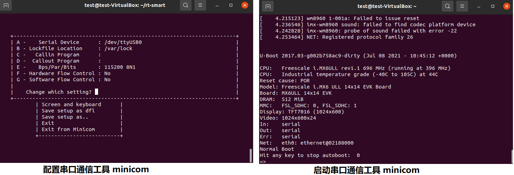

3. 将 ART-Pi Smart 开发板通过有线网口和测试电脑处于同一个局域网（例，将开发板和测试电脑通过网线连接到同一台路由器或交换机）

   ⚠️将网线插到 ART-Pi Smart 开发板的网口，请检查网口上两个 LED 灯（绿色和黄色）是否亮起。

4. 将 USB-TypeC（下面的）连接到电脑给开发板上电，上电时将默认从 eMMC 启动，自动运行 U-Boot

5. 在进入 “uboot 启动” 倒计时结束之前，按下键盘任意键，进入到手动模式

   ⚠️如果在倒计时结束之前，没有进入到手动模式，则开发板会自动进入到 i.MX6ULL 核心板自带的嵌入式 Linux 系统。

6. 输入命令，将 rt-smart 内核固件文件 rtthread.bin，通过网络加载至内存中运行

7. 命令格式：dhcp  TFTP 服务器 IP（即，测试电脑 IP 地址）:固件文件（xx.bin文件）;dcache flush;go 固件入口地址

   ```bash
   dhcp 0x80001000 192.168.10.171:rtthread.bin;dcache flush;go 0x80001000
   ```

8. 如果都正常的话，在串口调试终端，就可以看到 rt-smart 内核系统的启动信息

   ```bash
   => dhcp 0x80001000 192.168.10.171:rtthread.bin;dcache flush;go 0x80001000       
   ethernet@02188000 Waiting for PHY auto negotiation to complete... done          
   BOOTP broadcast 1                                                               
   BOOTP broadcast 2                                                               
   BOOTP broadcast 3                                                               
   BOOTP broadcast 4                                                               
   *** Unhandled DHCP Option in OFFER/ACK: 213                                     
   DHCP client bound to address 192.168.10.169 (1797 ms)                           
   Using ethernet@02188000 device                                                  
   TFTP from server 192.168.10.171; our IP address is 192.168.10.169; sending thro1
   Filename 'rtthread.bin'.                                                        
   Load address: 0x80001000                                                        
   Loading: ####################################################                   
            3.4 MiB/s                                                              
   done                                                                            
   Bytes transferred = 756192 (b89e0 hex)                                          
   ## Starting application at 0x80001000 ...                                       
                                                                                   
    \ | /
   - RT -     Thread Smart Operating System
    / | \     5.0.0 build Nov  9 2021
    2006 - 2020 Copyright by rt-thread team
   lwIP-2.1.2 initialized!
   [15] E/drv.enet: emac device init success
   
   [20] I/I2C: I2C bus [i2c3] registered
   [76] I/SDIO: SD card capacity 1927168 KB.
   found part[0], begin: 69120, size: 1.857GB
   [92] E/drv.enet: 
   PHY Link down, please check the cable connection and link partner setting.
   
   [142] I/SDIO: emmc card capacity 3817472 KB.
   found part[0], begin: 2098176, size: 1000.0MB
   found part[1], begin: 1050674176, size: [157] I/touch: rt_touch init success
   [161] I/gt911: touch device gt911 init success
   [166] I/sal.skt: Socket Abstraction Layer initialize success.
   1.476GB
   found part[2], begin: -1671429120, size: 500.0MB
   file system initialization done!
   hello rt-smart
   msh />
   ```

   

9. rt-smart 内核跑起来之后，可以输入下面命令获取开板一些基本信息，操作方式与其 rt-thread RTOS 一样

   ```bash
   # 获取开发板 IP 地址
   msh />ifconfig
   
   network interface device: e1 (Default)
   MTU: 1500
   MAC: a8 5e 45 91 92 93 
   FLAGS: UP LINK_UP INTERNET_UP DHCP_ENABLE ETHARP BROADCAST IGMP
   ip address: 192.168.10.168
   gw address: 192.168.10.1
   net mask  : 255.255.255.0
   ipv6 link-local: FE80::AA5E:45FF:FE91:9293 VALID
   ipv6[1] address: 0.0.0.0 INVALID
   ipv6[2] address: 0.0.0.0 INVALID
   dns server #0: 192.168.10.1
   dns server #1: 0.0.0.0
   
   # 查看 SD 卡是否正常挂载，用户APP的 elf 固件是否已经提前存放到 SD 卡。执行 ls 命令，可以看到 SD 卡根目录下，会有一个 root 目录
   msh />ls
   Directory /:
   System Volume Information<DIR>                    
   root                <DIR>      
   
   # 进入到目录 root/bin,查看 SD 卡里面的用户 APP 固件
   msh />cd root/bin
   msh /root/bin>ls
   Directory /root/bin:
   hello.elf           202308                
   gpio.elf            203448                                    
   ping.elf            203572                   
   pong.elf            203004           
   ```

   

## 用户 APP 示例演示：hello

```bash
# 进入到用户 APP 应用程序目录：root/bin/
msh />cd root/bin

# 显示 bin 目录下的用户 APP 是否已存在 hello.elf 用户 APP 固件文件
msh /root/bin>ls

Directory /bin:               
hello.elf           202308                   
gpio.elf            203448   

# 运行用户 APP: hello.elf 
msh /root/bin>hello.elf

# 运行了一次编译的应用程序 root/bin/hello.elf，可以看到应用程序输出 hello world! 打印信息后自动退出
msh /root/bin>hello world!
```


# 用户 APP 示例：apps

rt-smart 的用户 APP 的启动方式与内核的启动方式完全不同。

- 需要提前将 root 文件夹（包含了用户 APP 的 elf 固件文件）通过 USB 读卡器直接复制到 SD 卡，并将 SD 卡插到 ART-Pi Smart 开发板背面的 Micro SD 卡槽

- 在内核跑起来之后，只需要在 MSH 下找到用户 APP 固件的存储目录，并输入对应 “ xx.elf ”，即可运行此 用户 APP（类似于 Linux 系统的 shell 脚本启动）

- 如果用户 APP 需要保持在后台运行状态，则需要执行用户 APP的命令增加字符 "&" 。例如，运行用户 APP: ntp.elf 并保持在后台运行

  ```bash
  # 运行用户 APP: ntp.elf 并保持在后台运行
  msh /root/bin>ntp.elf &
  ```

根据上面章节，搭建好 Windows 或 Linux 开发环境，并设置好相关的环境变量，之后用户 APP 的编译和运行等操作基本一样。故下面 rt-smart 用户 APP 示例，将不区分 Windows 或 Linux 环境。

## Hello 应用示例

找到 hello.elf 用户 APP 固件所示目录，输入 hello.elf 即可运行此用户 APP。

```bash
# 进入到用户 APP 应用程序目录：root/bin/
msh />cd root/bin

# 运行用户 APP: hello.elf 
msh /root/bin>hello.elf

# 运行了一次编译的应用程序 root/bin/hello.elf，看到它输出 hello world! ，然后退出。
msh /root/bin>hello world!
```

## gpio 应用示例

运行 gpio.elf 用户 APP 之后，ART-Pi Smart 开发板上的 绿色 “LED2” 将开始每 200 ms 闪烁一次。

```bash
# 进入到用户 APP 应用程序目录：root/bin/
msh />cd root/bin

# 运行用户 APP: gpio.elf 
msh /root/bin>gpio.elf
```

## Ping/Pong 应用示例

以下是一份最基本的客户端与服务端，他们之间通过 IPC channel 的方式进行交互。

- pong 服务端实现的是一个消息接收，当收到消息数据时，再返回给客户端。

- ping 客户端会把一段字符串数据发送给 pong 进程。它会先准备这段字符串数据，然后从共享内存中创建出一块共享内存数据块，并把数据复制到共享内存数据块上，然后把共享内存数据 id 通过通道发送给 pong 进程。

  

- 具体运行过程：

```bash
# 进入到用户 APP 应用程序目录：root/bin/
msh />cd root/bin

# 先运行用户 APP: pong.elf (注意：需要 pong 在后面保持运行，故需要在命令的结尾加入 & 字符)
msh /root/bin>pong.elf &
msh />
Pong: wait on the IPC channel: 3

# 再运行另外一个用户 APP: ping.elf
msh /root/bin>ping.elf

# 显示通信过程：
msh /root/bin>
Ping: send count = 0
Pong: receive count = 0
Pong: reply count = 0
Ping: receive the reply 0

Ping: send count = 1
Pong: receive count = 1
Pong: reply count = 1
Ping: receive the reply 1

Ping: send count = 2
Pong: receive count = 2
Pong: reply count = 2
Ping: receive the reply 2

......
......

Ping: send count = 98
Pong: receive count = 98
Pong: reply count = 98
Ping: receive the reply 98

Ping: send count = 99
Pong: receive count = 99
Pong: reply count = 99
Ping: receive the reply 99
```

## uart  应用示例

1. 此示例使用 ART-Pi Smart 开发板上的 uart 3 作为被测对象，根据硬件连接图，将测试电脑和开发板的 UART 3 （TTL）通过 USB 转串口线连接起来

   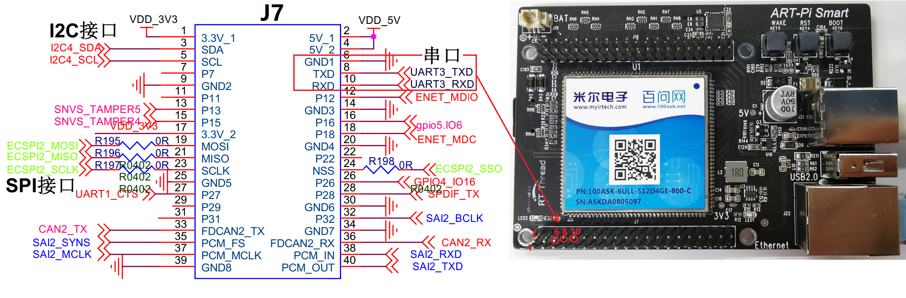

2. 通过 Menuconfig 工具在内核代码中添加 UART 3 设备

   ```bash
   # 进入到 rt-smart 的 imx6ull-artpi-smart BSP 内核目录
   > cd rt-smart\kernel\bsp\imx6ull-artpi-smart\
   
   # 通过 Menuconfig 工具在内核代码中添加 UART 3 设备
   > menuconfig
   ```

   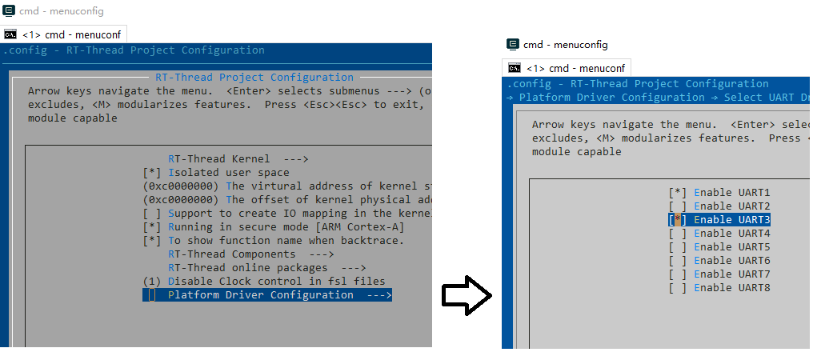

3. 重新编译 rt-smart 内核，生成新的内核固件：rtthread.bin、rtthread.imx

   ```bash
   # 清除编译生成的临时文件和目标文件
   > scons -c
   
   # 编译 rt-smart 内核
   > scons 
   ```

4. 将编译好的用户 APP 固件 uart.elf 通过读卡器复制到 SD 卡，并将 SD 卡插回开发板的 SD 卡槽

5. 测试电脑上打开 2 个串口调试终端。其中，串口调试终端 1 用于打印调试信息和发送 MSH 命令，串口调试终端 2 配置成与 UART 3 对应的 COM 口（115200 波特率、8 位数据位、1 位停止位、无奇偶校验、无流控）

6. 通过 Tftp 或 USB 重新烧写 rt-smart 内核固件

7. 找到 uart.elf 用户 APP 固件所在目录，串口调试终端 1 输入 uart.elf 并运行此用户 APP，就可以在 串口调试终端 2 看到相应的打印信息：hello rtthread

   ```bash
   # 进入到用户 APP 应用程序目录：root/bin/
   msh />cd root/bin
   
   # 运行用户 APP: uart.elf 
   msh /root/bin>uart.elf
   ```

   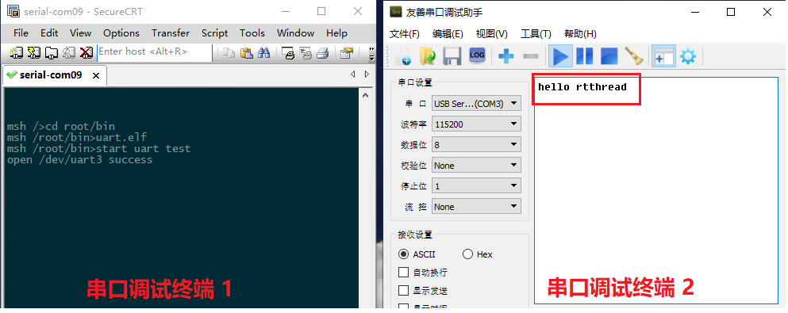

8. 通过串口调试终端 2 发送十六进制数据 （0xAA）给开发板，查看 ART-Pi Smart 终端是否收到数据

   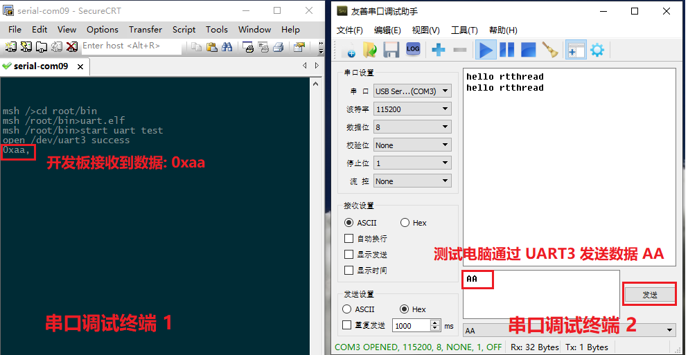

## vi 应用示例

此示例实现了 vi 工具的功能，可以通过 vi 工具查看、编译文件。

```bash
# 进入到用户 APP 应用程序目录：root/bin/
msh />cd root/bin

# 新建一个 test.txt 文件，文件内容为 "hello RT-Thread!!"
msh /root/bin>echo "hello RT-Thread!!" test.txt

# 运行用户 APP: vi.elf 要查看的文件
msh /root/bin>vi.elf test.txt
```

## ntp 应用示例

[NTP](https://baike.baidu.com/item/NTP) 是网络时间协议（Network Time Protocol），它是用来同步网络中各个计算机时间的协议。 在 RT-Thread 上实现了 NTP 客户端，连接上网络后，可以获取当前 UTC 时间。

```bash
# 进入到用户 APP 应用程序目录：root/bin/
msh />cd root/bin

# 运行用户 APP: ntp.elf 并保持在后台运行
msh /root/bin>ntp.elf &
Get local time from NTP server: Tue Nov  9 19:23:53 2021

# 输入 date 命令显示当前实时时间
msh /root/bin>date
Tue Nov  9 19:24:51 2021
```

## webserver 应用示例

此用户 APP 中集成了 RT-Thread 生态系统中的 webnet 软件包，实现简单的 webserver 功能。

[webnet](http://packages.rt-thread.org/detail.html?package=webnet)  软件包是 RT-Thread 自主研发的，基于 HTTP 协议的 Web 服务器实现，它不仅提供设备与 HTTP Client 通讯的基本功能，而且支持多种模块功能扩展，且资源占用少、可裁剪性强，充分满足开发者对嵌入式设备服务器的功能需求。

⚠️ 此 webserver 示例（基于 webnet）和下一章节要介绍的 webserver 网关（基于 uhttpd、出厂示例）完全不一样，即用的是完全不一样的软件包。

1. 首先，先检查 rt-smart 文件系统的 /root/webnet/ 路径下面是否已经存在 webnet 相关的网页文件

   - ART-Pi Smart 开发板出厂时会将 webnet 相关的网页文件都提前存到 rt-smart 所使用的 emmc 第四分区（即 mmc 1:4）
   - 如果 /root/webnet/ 路径下没有 webnet 网页文件，也可以从 sdk_art_pi_smart 软件包目录  /documents/firmwares/root 的 root 整个文件夹直接复制到  SD 卡根目录下面，然后通过 /sd/root/webnet 下来访问 webnet 网页信息
   - 注意，SD 卡会默认挂载到 rt-smart 文件系统下面的 /sd 目录下

2. rt-smart 内核跑起来之后，运行 webserver.elf 用户 APP

   ```bash
   # 进入到用户 APP 应用程序目录：root/bin/
   msh />cd root/bin
   
   # 运行用户 APP: webserver.elf 并保持在后台运行
   msh /root/bin>webserver.elf &
   [D/wn.log] server initialize success.
   
   # 获取开发板的 IP 地址
   msh /root/bin>ifconfig
   
   network interface device: e1 (Default)
   MTU: 1500
   MAC: a8 5e 45 91 92 93 
   FLAGS: UP LINK_UP INTERNET_UP DHCP_ENABLE ETHARP BROADCAST IGMP
   ip address: 192.168.10.168
   gw address: 192.168.10.1
   net mask  : 255.255.255.0
   ipv6 link-local: FE80::AA5E:45FF:FE91:9293 VALID
   ipv6[1] address: 0.0.0.0 INVALID
   ipv6[2] address: 0.0.0.0 INVALID
   dns server #0: 192.168.10.1
   dns server #1: 0.0.0.0
   ```

3. 如果输入 webserver.elf &  运行此 APP 时，出现 Log： Bind socket failed, errno=1，说明另外一个 Webserver （基于 uhttpd）正在运行中

   此时，需要通过下面方法，先 Kill 掉 Webserver （基于uhttpd）进程，然后重新运行此 webserver (基于 webnet)

   ```bash
   # 通过 list_process 命令列出当前正在运行的所有进程，可以看 uhttpd 对应的 PID 为 22
   msh /root/bin>list_process
   PID  CMD      thread   pri  status      sp     stack size max used left tick  error
   ---- -------- -------- ---  ------- ---------- ----------  ------  ---------- ---
        kernel   tshell    20  running 0x000001e4 0x00001000    54%   0x00000006 -09
        kernel   sd_mount  30  suspend 0x000000e0 0x00000800    27%   0x0000000f 000
        kernel   sys_work  23  suspend 0x00000098 0x00001000    34%   0x0000000a -09
        kernel   link_d1   30  suspend 0x000000e0 0x00001000    13%   0x00000002 000
        kernel   mmcsd_de  22  suspend 0x000000f8 0x00001000    20%   0x0000000d -09
        kernel   tcpip     10  suspend 0x00000144 0x00002000    15%   0x00000013 -09
        kernel   etx       12  suspend 0x000000f0 0x00002000    04%   0x0000000a -09
        kernel   erx       12  suspend 0x000000f8 0x00002000    10%   0x0000000f -09
        kernel   tidle0    31  ready   0x00000078 0x00002000    11%   0x0000000f -09
        kernel   timer      4  suspend 0x000000d0 0x00001000    07%   0x00000004 000
     22 uhttpd.e uhttpd.e  25  suspend 0x00000190 0x00004000    07%   0x000000c7 -09
     
   # 通过 kill 命令, 删除 uhttpd 进程，其中 22 为 uhttpd 进程对应的 PID 号
   msh /root/bin> kill 22 -s 9
   
   # 重新运行此 webserver (基于 webnet)
   msh /root/bin>webserver.elf &
   ```

   

4. 打开浏览器输入开发板 IP 地址，即可访问开发板上的文件系统:

   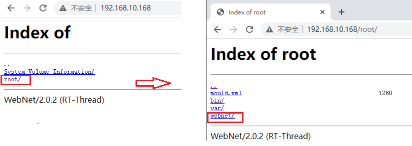

5. 点击 root 目录，再点击 webnet  目录，进去之后，就可以打开 webserver 的一个 Sample 主页

   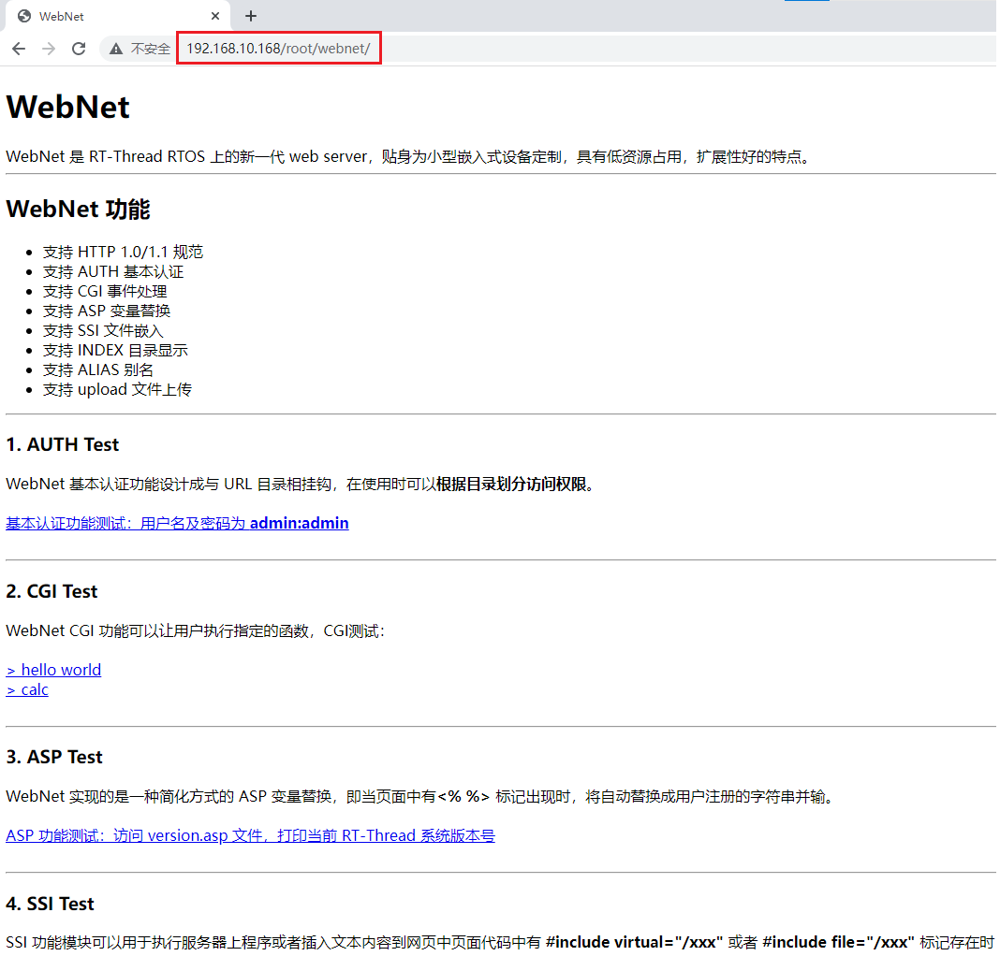


## webclient 应用示例

此用户 APP 中集成了 RT-Thread 生态系统中的 webclient软件，实现简单的 webclient 功能。

[webclient](http://packages.rt-thread.org/detail.html?package=webclient) 软件包是 RT-Thread 自主研发的，基于 HTTP 协议的客户端的实现，它提供设备与 HTTP Server 的通讯的基本功能。

## uPnP 应用示例

⚠️uPNP 服务依赖 webserver，所以需要现将 webserver 启动起来运行。

1. 先将 rt-smart/userapps/apps/uPnP/ 目录下的 mould.xml 文件，复制到 SD 卡 根据目录下的 root 文件夹内，即 root/mould.xml

2. 上电 ART-Pi Smart 开发板，并将 rt-smart 内核跑起来

3. 然后，先将 webserver 启动起来并保持在后台运行

   ```bash
   # 进入到用户 APP 应用程序目录：root/bin/
   msh />cd root/bin
   
   # 运行用户 APP: webserver.elf 并保持在后台运行
   msh /root/bin>webserver.elf & 
   ```

4. 再执行 uPnP.elf & 启动 uPnP 服务并保持在后台运行

   ```bash
   # 进入到用户 APP 应用程序目录：root/bin/
   msh />cd root/bin
   
   # 运行用户 APP: uPnP.elf 并保持在后台运行
   msh /root/bin>uPnP.elf & 
   ```

5. 在 PC 上的网络邻居是否能够发现 ART-Pi Smart 设备：imx6ull-art-pi

   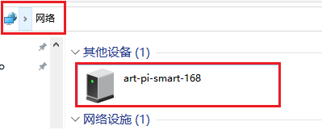

6. 如果能够找到设备，双击设备（art-pi-smart-168）就会自动跳转到 webserver 主页

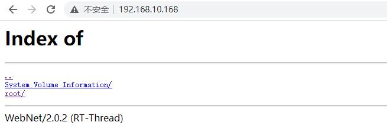

## i2c 应用示例

此示例需要外接 LCD 扩展屏，通过 i2c 来控制 LCD 的触摸屏。

在 LCD 显示上的触控设备 gt911 通过 i2c 接口 与 i.MX6ULL 处理器通信，通过观测触摸 LCD 显示屏终端打印的坐标信息来判断 i2c 接口是否正常

```bash
# 进入到用户 APP 应用程序目录：root/bin/
msh />cd root/bin

# 运行用户 APP: i2c.elf 并保持在后台运行
msh /root/bin>i2c.elf &
```

测试过程：通过触摸 LCD ，并观测终端打印的坐标信息

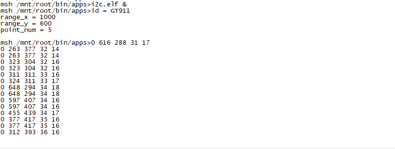


## pwm 应用示例

此示例需要外接 LCD 扩展屏，通过 PWM 来控制 LCD 背光的亮度。

```bash
# 进入到用户 APP 应用程序目录：root/bin/
msh />cd root/bin

# 运行用户 APP: pwm.elf 
msh /root/bin>pwm.elf
```


# 用户 APP（gnu-apps）： webserver 网关开发环境搭建

⚠️ webserver 网关示例中的用户 APP 源码不是采用 scons 编译方式，而是采用 make 编译方式。故仅适用于 Linux 开发环境。

⚠️需要了解 Makefile 的基本语法及编译过程。

### 环境准备（基于 Linux 环境）

安装一些必要的软件环境：

```bash
$ sudo apt update
$ sudo apt install git bzip2 wget patch
$ sudo apt install gcc
$ sudo apt install scons
$ sudo apt install make
$ sudo apt install libncurses-dev
$ sudo apt install libpng-dev
$ sudo apt install libncurses5
```

### 设置环境变量

```bash
# 进入到 rt-smart 目录
$ cd rt-smart

# 设置对应的环境变量（rt-smart 工具链、编译器等）
$ source smart-env.sh
```

### 编译 rt-smart 内核代码

请参考前面章节 “编译 rt-smart 内核代码” 。如果在前面章节已经编译好 rt-smart 内核固件的话，则在此无需重新编译 rt-smart 内核代码。

### 编译 gnu-apps libs 依赖库

编译之前，确保 rt-smart/userapps/root/bin/ 目录存在。如果不存在，需要自己新建一下目录。或者在 rt-smart/userapps/ 目录下，打开终端先执行一下 scons 命令就会自己编译 rt-smart/userapps/apps 里面的用户 APP 的同时，会自动生成所需要的目录 rt-smart/userapps/root/bin/ 。

⚠️如果在 Linux 下打开新的终端，记得重新设置一遍环境变量（rt-smart 工具链、编译器等）

```bash
# 进入到 rt-smart/userapps/gnu-apps 目录
$ cd rt-smart/userapps/gnu-apps

# 编译 gnu-apps 的库 libs
$ ./build.sh libs

# 编译成功后：
# 1)在 rt-smart/userapps/sdk/include 目录下会安装相应的头文件
# 2)在 rt-smart/userapps/sdk/lib 目录下会生成编译好的 *.a 库文件
# 3)会显示下面的 Log
========= Copy lib and headers =========
========= Freetype building finished. =========

```

### 编译用户 APP：uhttpd 

```bash
# 进入到 rt-smart/userapps/gnu-apps/uhttpd 目录
$ cd uhttpd

# 编译 用户 APP：uhttpd
./build_uhttpd.sh

# 编译成功：
# 1)在 rt-smart/userapps/root/bin 下会生成相应 elf 固件文件：uhttpd.elf
# 2)会显示下面的 Log 
========= Copy uhttpd to root/bin =========
========= uHttpd building finished. =========

```

### 编译用户 APP：sqlite 

```bash
# 进入到 rt-smart/userapps/gnu-apps/sqlite  目录
$ cd sqlite

# 编译 用户 APP：sqlite
./build_sqlite.sh 

# 编译成功：
# 1)在 rt-smart/userapps/root/ 目录下面，会新增加一个 var 文件夹 
# 2)在 rt-smart/userapps/root/bin 下会生成相应 elf 固件文件
# 3)会显示下面的 Log 
========= Copy sqlite3.elf and sqlite_test.elf to root/bin =========
========= Sqlite building finished. =========

```

### 拷贝 web 网页文件

```bash
# 进入到 rt-smart/userapps/gnu-apps/art-pi-demo-web 目录
$ cd art-pi-demo-web

# 执行下面脚本，会将dist下所有内容（网页文件）拷贝到 rt-smart/userapps/root/var/dist 下
./build_web.sh
```

到此为止，webserver 网关所需要的所有固件和网页文件都准备好了。将 rt-smart/userapps/ 目录下面的 root 文件夹拷贝到 SD 卡，然后启动 ART-Pi Smart 开发板，确保 SD 卡挂载到 rt-smart 文件系统的 /sd 目录下，启动 uhttpd 服务，就可以把 webserver 网关跑起来。

### ART-Pi Smart 上运行 webserver 网关

1.由于 ART-Pi smart 出厂已经自动运行了 emmc 里面的 webserver (uhttpd.elf 用户 APP)。故如果要用 SD 卡里面的固件和网页文件来运行 webserver, 需要先 Kill 掉 webserver（基于uhttpd）进程（开机时从 emmc 自动运行的用户 APP），然后重新运行此 webserver。

```bash
# 通过 list_process 命令列出当前正在运行的所有进程，可以看 uhttpd 对应的 PID 为 1
msh />list_process
PID  CMD      thread   pri  status      sp     stack size max used left tick  error
---- -------- -------- ---  ------- ---------- ----------  ------  ---------- ---
     kernel   tshell    20  running 0x000001e4 0x00001000    54%   0x00000006 -09
     kernel   sd_mount  30  suspend 0x000000e0 0x00000800    27%   0x0000000f 000
     kernel   sys_work  23  suspend 0x00000098 0x00001000    34%   0x0000000a -09
     kernel   link_d1   30  suspend 0x000000e0 0x00001000    13%   0x00000002 000
     kernel   mmcsd_de  22  suspend 0x000000f8 0x00001000    20%   0x0000000d -09
     kernel   tcpip     10  suspend 0x00000144 0x00002000    15%   0x00000013 -09
     kernel   etx       12  suspend 0x000000f0 0x00002000    04%   0x0000000a -09
     kernel   erx       12  suspend 0x000000f8 0x00002000    10%   0x0000000f -09
     kernel   tidle0    31  ready   0x00000078 0x00002000    11%   0x0000000f -09
     kernel   timer      4  suspend 0x000000d0 0x00001000    07%   0x00000004 000
  1 uhttpd.e uhttpd.e  25  suspend 0x00000190 0x00004000    07%   0x000000c7 -09
  
# 通过 kill 命令, 删除 uhttpd 进程，其中 1 为 uhttpd 进程对应的 PID 号
msh /> kill 1 -s 9

# 重新运行此 webserver (基于 uhttpd)
msh />/sd/root/bin/uhttpd.elf -f -p 80 -h /sd/root/var/dist &
```


2.Webserver运行起来后的其他操作，请参考上面已经介绍过的章节 “开机体验 rt-smart：webserver 网关” 。


# 调试工具及调试方法

## GDB 在线调试

rt-smart 内核跑起来之后，用户可以对用户 APP 进行源码级调试，并且可以在 VSCode 上进行 gdb 源码级在线调试。

用户可以对用户态应用程序进行源码级调试，这个相当于在内核中植入一个 gdb stub 来调试用户态的应用程序。

rt-smart gdb 调试的基本原理：通过 Kernel 来调试用户 APP。即通过 Kernel 上运行 gdb server 和测试电脑（gdb client）配合对用户 APP进行在线调试。

## VSCocde 调试

在开发环境上，用户可以通过安装 rt-smart VSCode 插件并使用轻量级的 VSCode 编辑器进行开发，例如编辑代码、远程登陆到 Linux 服务器上进行开发、使用 VSCode 并结合 gdb 进行用户应用程序的在线调试等。

具体的操作说明，请查阅文档《RT-Thread Smart for Vscode 快速上手》。

## FinSH 控制台：Shell 调试工具

[FinSH](https://www.rt-thread.org/document/site/#/rt-thread-version/rt-thread-standard/programming-manual/finsh/finsh) 是 RT-Thread 的命令行组件，提供一套供用户在命令行调用的操作接口，方便实时查看内核运行状态，如任务信息、堆栈信息、定时器信息、内存信息等。它可以使用串口 / 以太网 / USB 等与 PC 机进行通信。

## ulog 日志系统

[ulog](https://www.rt-thread.org/document/site/#/rt-thread-version/rt-thread-standard/programming-manual/ulog/ulog) 是一个非常简洁、易用的 C/C++ 日志组件，可以将软件运行的状态、过程等信息，输出到不同的介质中（例如：文件、控制台、显示屏等），并进行显示和保存。为软件调试、维护过程中的问题追溯、性能分析、系统监控、故障预警等功能，提供参考依据。

## menuconfig 工具

RT-Thread 借助 [Kconfig](https://www.rt-thread.org/document/site/#/development-tools/kconfig/kconfig) 文件生成的配置文件 rtconfig.h 来配置系统，Kconfig 文件是各种配置界面的源文件。当在 bsp 目录下使用 env 工具执行 menuconfig 命令时会出现 RT-Thread 系统的配置界面，所有配置工具都是通过读取当前 bsp 目录下的 Kconfig 文件来生成配置界面的，这个文件就是所有配置的总入口，它会包含其他目录的 Kconfig 文件。配置工具读取各个 Kconfig 文件，生成配置界面供开发人员配置系统，最终生成 RT-Thread 系统的配置文件 rtconfig.h。

同样，rt-smart 也可以使用 menuconfig  工具来对内核和组件的功能进行配置，对组件进行裁剪。


# 常见问题解答

## 问题 01：用 TFTP 方式下载内核固件到开发板时，无法正常下载并显示一直处理下载中

- 问题描述：TFTP 无法下载固件，并且显示如下 Log

  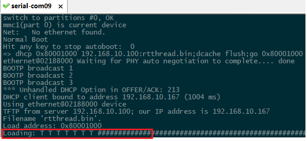

- 解决方案：先暂时关闭一下测试电脑的防火墙，等成功下载固件到开发板之后，再重新启用防火墙

  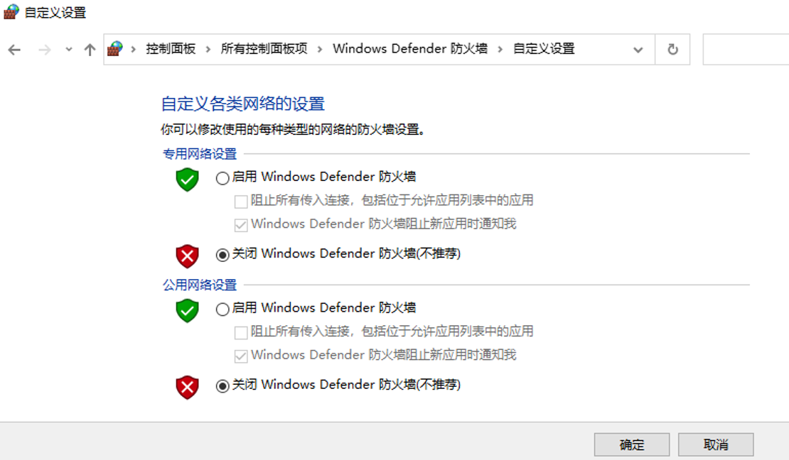

## 问题 02：编译失败

- 问题描述：编译代码时显示链接失败，并且显示如下 Log

  ```
  arm-linux-musleabi-g++: error: t\userapps\linker_scripts\arm\cortex-a\link.lds: No such file or directory
  scons: *** [hello.elf] Error 1
  
  或
  
  scons: Building targets ...
  scons: building associated VariantDir targets: build\hello
  scons: *** [build\hello\main.o] UnicodeDecodeError : 'ascii' codec can't decode byte 0xd6 in position 73: ordinal not in range(128)
  scons: building terminated because of errors.
  ```

- 解决方案：
  - 检查工程项目的路径，不要有中文的字符（包括中文的符号），也不要有空格。否则在编译代码时，可能会编译失败
  - 检查是否配置编译环境，编译代码之前是否执行了 source smart-env.sh (Linux 环境) 或 smart-env.bat (Windows 环境)

## 问题 03：无法运行arm-none-eabi-gdb:找不到libncurses.so.5

- 问题描述：编译代码时，显示 Log

  ​		无法运行arm-none-eabi-gdb:找不到libncurses.so.5

- 解决方案：执行下面命令安装 libncurses5 软件包

  sudo apt install libncurses5

# 扩展资料

## rt-smart 相关资源

| 资源 / 文档            | 描述 / 链接                                                  |
| ---------------------- | ------------------------------------------------------------ |
| RT-Thread 入门指南     | https://www.rt-thread.org/document/site/#/other/novice-guide/README |
| rt-smart 入门指南       | https://www.rt-thread.org/document/site/#/rt-thread-version/rt-thread-smart/rt-smart-quickstart/rt-smart-quickstart |
| rt-smart 架构说明       | https://www.rt-thread.org/document/site/#/rt-thread-version/rt-thread-smart/architecture/architecture |
| rt-smart 进程概述      | https://www.rt-thread.org/document/site/#/rt-thread-version/rt-thread-smart/rt-smart-lwp/rt-smart-lwp |
| rt-smart sdk 代码+工具链： | http://117.143.63.254:9012/www/rt-smart/                     |
| Env 用户手册           | https://www.rt-thread.org/document/site/#/development-tools/env/env |
| RT-Thread Smart微内核最小系统移植 | https://download.100ask.org/videos_tutorial/RTOS/RT-Thread_Smart/index.html |

## ART-Pi Smart 开发板相关资源

| 资源 / 文档                                   | 描述 / 链接                                                  |      |
| --------------------------------------------- | ------------------------------------------------------------ | ---- |
| i.MX6ULL 系列处理器详细资料，NXP 官方网页链接 | https://www.nxp.com.cn/products/processors-and-microcontrollers/arm-processors/i-mx-applications-processors/i-mx-6-processors/i-mx-6ull-single-core-processor-with-arm-cortex-a7-core:i.MX6ULL |      |
| 100ask_imx6ull烧写工具下载地址                | https://github.com/100askTeam/gui_for_nxp_uuu/tree/master/100ask_imx6ull%E7%83%A7%E5%86%99%E5%B7%A5%E5%85%B7 |      |
| 100ask_imx6ull烧写工具 git  仓库              | https://github.com/100askTeam/gui_for_nxp_uuu                |      |
| 100ask_imx6ull烧写工具设计与使用说明          | http://wiki.100ask.org/100ask_imx6ull_tool                   |      |

## 技术支持：

可以到 RT-Thread 嵌入式开源社区，提交 rt-smart 相关的问题：https://club.rt-thread.org/index.html

