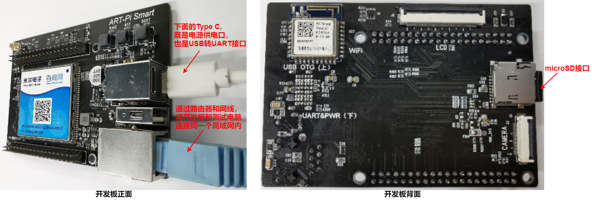
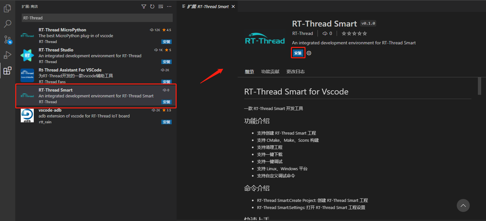
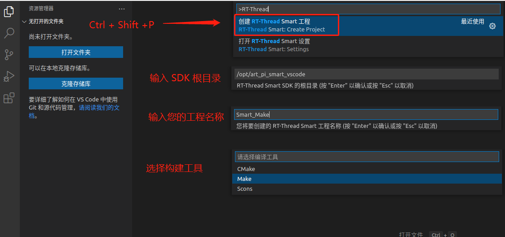
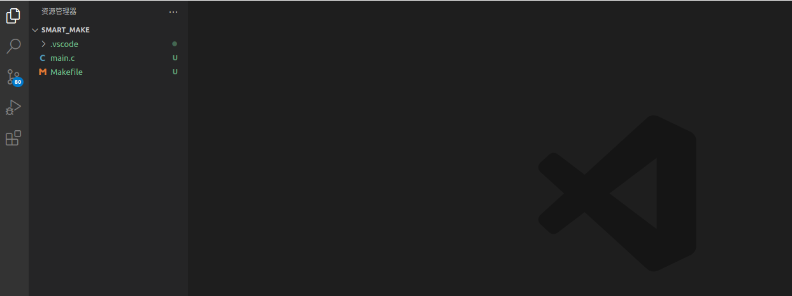
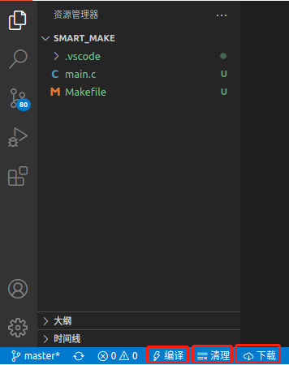
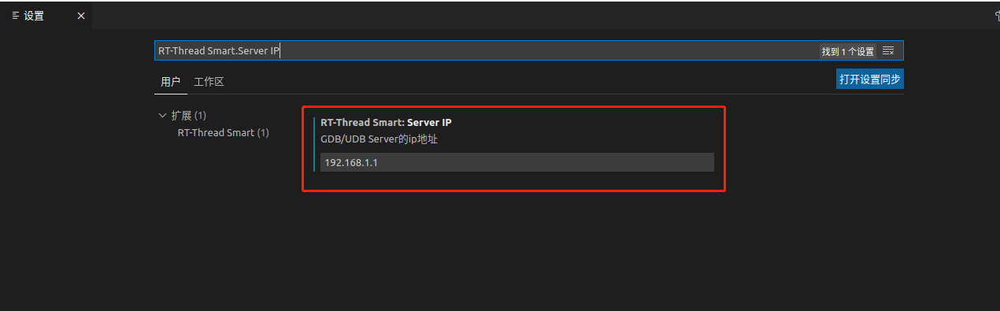
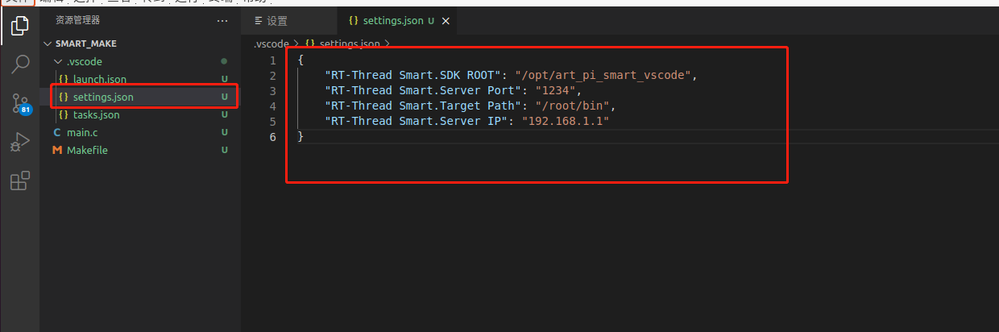
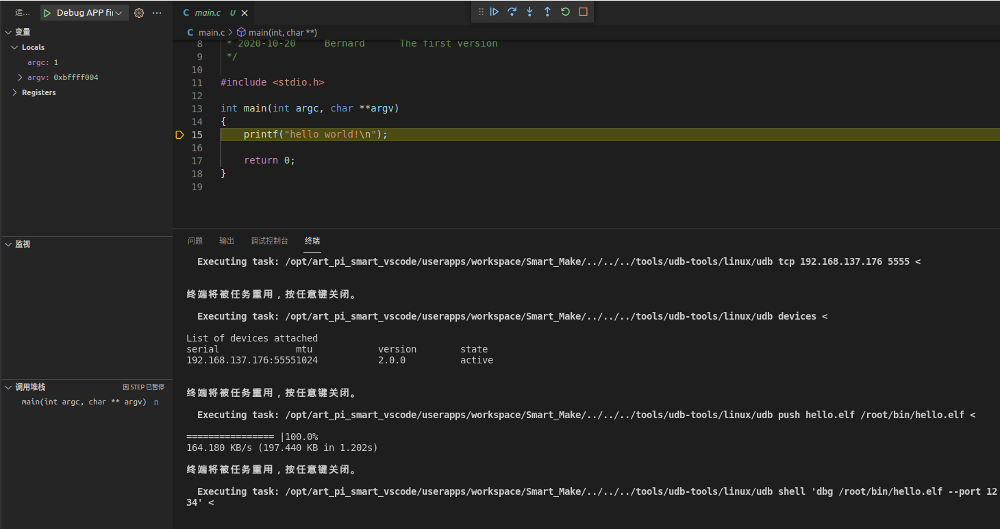
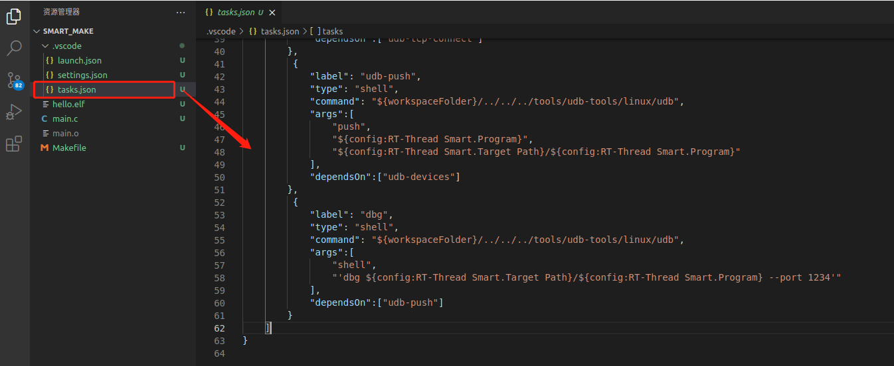

# RT-Thread Smart for Vscode 快速上手

## ART-Pi Smart 环境快速搭建

### 硬件环境搭建

- 电源输入：5V，500 mA，通过开发板 USB-TypeC（下面）供电。如下图所示，通过测试电脑的 USB 直接对开发板供电
- 串口连接：下方的 USB-TypeC 接口，既是用作电源供电，同时也是 USB 转 UART 接口，主要用于打印系统的控制台输入和输出

| 波特率 | 数据位 | 停止位 | 校验位 | 流控 |
| :----- | ------ | ------ | ------ | ---- |
| 115200 | 8      | 1      | 无     | 无   |

- 网络接口：通过路由器和网线，将开发板和测试电脑连接在同一个局域网内

  

### 工具链的下载和安装

- rt-smart 采用的工具链为：arm-linux-musleabi 工具链
- 需要用户自行通过下面网址下载 Linux版本或 Windows 版本的工具链
- 链接: https://pan.baidu.com/s/1p7PRhV3dTGIb7hxv34YWYw 提取码: ndxq 
- 将下载下来的工具链，解压到指定的路径 /rt-smart/tools/gnu_gcc/ 下面

### 内核固件下载和启动

1.在 VSCode 上开发 rt-smart 用户应用程序时，需要用户提前将编译好的 rt-smart 内核固件下载到开发板的内存上运行。

- 编译好的 rt-smart 内核固件，存放于路径：/rt-smart/documents/firmwares/kernel 

- 通过 Uboot + TFTP 方式或 USB 方式 启动 rt-smart 内核，具体操作请查阅文档：[ART-Pi Smart 用户手册](documents/art_pi_smart_user_manual/README.md) 。

2.rt-smart 内核跑起来之后，用户就可以在 VSCode上进行用户应用程序的开发，包括：

- VSCode 下创建用户应用工程
- 编译用户应用工程
- 下载用户应用固件到开发板
- 在 VSCode下通过 gdb 在线调试用户应用代码


## 安装 RT-Thread Smart 扩展插件

在 Vscode 应用商店中，搜索 RT-Thread Smart,  选择下图所示扩展，点击 `安装` 即可：



## 创建工程：用户应用 APP

执行快捷键 `Ctrl_Shift+P`, 输入 `RT-Thread` 关键字，选择 `创建 RT-Thread Smart 工程`, 然后按提示执行以下操作：

- 输入 SDK 根目录
- 输入工程名称
- 选择构建工具（linux 平台支持 CMake、Make、Scons， Windows 平台只支持 Scons） 



接下来你就会看到一个自动创建好的 RT-Thread Smart 工程：

 


## 编译/清理/下载

点击 Vscode 左下角的 `编译`、`清理` 或者 `下载` 工具，会为您自动 `编译工程（用户 APP）`、`清理工程`或者 `推送用户 APP 固件文件到开发板`

 

您需要注意的是：

- windows 系统编译/清理时，如果终端提示

  ```
  'scons' 不是内部或外部命令，也不是可运行的程序
  ```

  请执行 `pip install scons` ，安装 scons 命令

- `下载前`，如果您未设置 Server 的 ip 地址，插件为为您自动定位到 IP 的设置位置，你只需要填写 IP 地址并重新点击 `下载` 即可。

  

  您也可以直接在 .vscode/settings/json 中修改对应的 ip 地址

  

  

## 调试：gdb 在线调试用户应用程序

直接快捷键 `F5`, 即可启动调试



如果你想在调试前添加一些任务或者删除一些任务，只要到修改 .vscode/tasks.json 中的内容即可：

